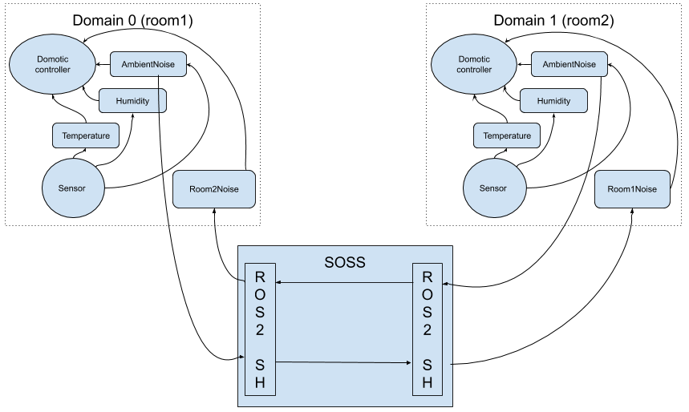

rosis
=====

ROSIS (ROS2 Integration Services) is an implementation that uses SOSS to connect ROS2 to different systems, allowing also connection through TCP.

Setup
=====
This repository has a workspace already distributed in order to make easy starting a connection between ROS2 and any other system.

If the repository is downloaded with the recursive option (git clone --recursive https://gitlab.intranet.eprosima.com/eProsima/soss/rosis), the initial layout will include a folder with a workspace, wich contains a src (source) directory. Inside that last folder, the SOSS project and the ROS2 system handle will be downloaded and ready to build.

With this layout SOSS can already be used to connect two ROS2 instances through TCP, as defined in the use cases section of this document.

If the user wants to connect with other systems, the system handle for each system to be connected must be downloaded separately. To make things easier, this repository includes in its root directory a file called rosis.repos, to be used together with [vcstool](https://github.com/dirk-thomas/vcstool) to clone eProsima's system handles. In the root dyrectory, execute the following command:

```
vcs import < ../../rosis.repos
```

This will clone the system handles into the folder workspace/src/plugins.

With that done, the workspace is ready to be built and used.

Usage
=====
0. Source a colcon environment in which ROS2 has been built (soss-ros2 uses rclcpp package).
1. cd the workspace folder
1. Build the necessary packages with colcon (e.g. for a ros2-fiware connection: colcon build --packages-up-to soss-ros2 soss-fiware)
1. Source the current workspace (source install/local_setup.bash)
1. Create a configuration file (an [example][config_example] can be found in the soss-fiware system handle)
1. Run an instance of SOSS with the configuration file (e.g. soss src/plugins/fiware/fiware/sample/hello_fiware_ros2.yaml)
1. Start sending messages. The two systems will communicate through soss now.

Use cases
=========

This implementation covers some use cases thanks to its multiple system handles, besides the case of connecting ROS2 with other systems.

With the DDS system handle, ROS2 adquires the capability of connecting to other systems through TCP, as shown in the [DDS system handle documentation][dds-SH].

Another use case for SOSS is domain changing. ROS2 allows to configure different domains in the same network, to give users the possibility of creating separate environments that won’t interfere with each other. A ROS2 node in a certain domain won’t be able to communicate with a node in other domain, even if they are a pair of publisher-subscriber in the same topic in the same LAN. This can be quite useful, but in some cases a user may want to communicate two different domains through a node, to allow only a certain amount of communication between them.



Domain change in SOSS is done using two ROS2 system handles, and is as easy to use as specifying a different domain for each of them. To specify the domain, the system map in the YAML configuration file must have a key-value pair for the domain such as the one seen in the following file:

```YAML
systems:
    room1: { type: ros2, domain: 0, node_name: "soss" }
    room2: { type: ros2, domain: 1, node_name: "soss" }
routes:
    room_1_to_2: { from: room1, to: room2 }
    room_2_to_1: { from: room2, to: room1 }
topics:
    Room1Noise: { type: "std_msgs/Float", route: room_1_to_2, remap: { room1: “AmbientNoise” }}
    Room2Noise: { type: "std_msgs/Float", route: room_2_to_1, remap: { room2: “AmbientNoise” }}
```

Notice that SOSS also includes a functionality to remap topic names, as seen in its documentation.
Initializing a SOSS instance with this YAML file will mirror the ambient noise topic from one room to the other, while leaving the rest of the topics independent even if they have the same topic name and data type.

Project layout
==============

This repository contains the following files and directories:

- Dockerfile: Dockerfile to have this same repository tested in a clean Ubuntu 16.04 environment.
- rosis.repos: File to be used with [vcstool](https://github.com/dirk-thomas/vcstool) in order to give the user the possibility to clone the repositories easier, pointing to the correct branch.
- docs: folder needed to display this document properly.
- workspace: folder in which SOSS project and its system handles will be cloned and built, as explained above.

[config_example]: https://gitlab.intranet.eprosima.com/eProsima/soss/soss-fiware/tree/master/fiware/sample
[dds-SH]: https://gitlab.intranet.eprosima.com/eProsima/soss/soss-dds
